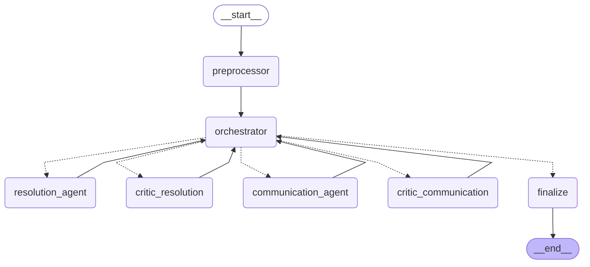

# 🚚 Multi-Agent Logistics Exception Handler

An AI-powered multi-agent system that autonomously detects, triages, and resolves last-mile delivery exceptions — built with LangGraph and OpenAI.

[](https://colab.research.google.com/github/jimmy-chihungchong/multi-agent-logistics-exception-handler/blob/main/logistics_agents.ipynb)


> 🎓 Capstone project for the **Post Graduate Program in AI Agents for Business Applications** — McCombs School of Business, The University of Texas at Austin (in collaboration with Great Learning).

---

## 📌 The Problem

Last-mile delivery is the most expensive and failure-prone leg of the logistics chain. When something goes wrong — a customer isn't home, an address is invalid, a package is damaged, weather blocks a route — human dispatchers must manually investigate each "exception," contact stakeholders, and decide on a resolution. This is slow, costly, and doesn't scale.

## 💡 The Solution

This project replaces that manual triage loop with a **team of specialized AI agents** that collaborate to handle delivery exceptions end-to-end:

1. A **preprocessor** validates the event, blocks malicious input, filters routine noise, and fetches all context (customer profile, locker availability, playbook) — before a single LLM call is made
2. A **Resolution Agent** consults the playbook and decides the fix; a **Critic Agent** reviews the decision and can approve, demand revision, or escalate
3. A **Communication Agent** drafts a personalized customer message in the right tone; a second critic validates it for tone, accuracy, and data leakage before send
4. A deterministic **orchestrator** routes every step and enforces escalation rules — humans only see cases that genuinely need judgment

The result: routine exceptions get resolved in seconds without human intervention, and humans only see the cases that genuinely need judgment.

---

## 🏗️ Architecture



### The Agents

| Agent | Role | Tools / Capabilities |
|---|---|---|
| 🛠️ **Resolution Agent** | It reads the situation, consults the playbook, and decides what to do — and if it cannot produce a valid answer after 3 tries, it escalates to a human rather than making a potentially wrong decision. | Operates on a restricted state view, **`ResolutionAgentView`**, which includes: `consolidated_event`, `customer_profile`, `locker_availability`, `playbook_context`, `escalation_signals`, and `critic_feedback` |
| 📣 **Communication Agent** | It reads the resolution decision and the customer's profile, then drafts a personalized message in the right tone for that customer — and if it cannot produce a proper message after 3 tries, it sends a generic fallback and flags the case for human review. | Operates on a restricted state view, **`CommunicationAgentView`**. This view is populated by the `preprocessor_node` with the results of previous tool calls: `customer_profile_full` (contains customer's full name), and `locker_availability` |
| ⚖️ **Critic Resolution Agent** | It reviews the **Resolution Agent's** decision against the playbook and context, and either approves it, sends it back for correction, or escalates it to a human supervisor if the situation is too complex or risky to handle automatically. | Operates on a restricted state view, **`CriticResolutionView`**, which contains: `consolidated_event`, `customer_profile`, `locker_availability`, `playbook_context`, `escalation_signals`, and `resolution_output` |
| 🛡️ **Critic Communication Agent** | It checks that the customer message has the right tone, accurately reflects the resolution, and contains no sensitive internal details before it is sent. Unlike the **Critic Resolution Agent**, it cannot request a revision — it can only approve or escalate. | Operates on a restricted state view, **`CriticCommunicationView`**, which includes: `consolidated_event`, `customer_profile`, `resolution_output`, and `communication_output` |

### Non-LLM Nodes

| Node | Role | Tools / Capabilities |
|---|---|---|
| 🧭 **Preprocessor** | It cleans the data, blocks malicious inputs, filters out routine noise, and fetches everything the agents need, all before a single LLM call is made. | Invokes the system's external tools: `lookup_customer_profile`, `check_locker_availability`, and `search_playbook` |
| 🪄 **Orchestrator** | It looks at the current state of the shared **`UnifiedAgentState`** (the system's whiteboard) and decides who should act next, ensuring the pipeline always follows the correct sequence, enforces escalation rules, and never skips a critical validation step. | Does not directly invoke external tools like the preprocessor does. Instead, it serves as the **deterministic central router** of the system. Its _"tools"_ are the state variables it evaluates to decide the next path: **Guardrail State**, **Noise Flags**, **Completion Logic**, **Loop Management**, and **Escalation Enforcement**. While the preprocessor handles data retrieval, the orchestrator handles **policy enforcement and flow control.** |
| 📦 **Finalize** | It collects all the work done by every agent, packages it into one clean, auditable record, stamps the total processing time, and closes the case. | Does not invoke any external tools or internal agent nodes. Its function is purely administrative within the graph: it reads the state (using the `RouterView` projection), packages the final results into a structured dictionary for the user, calculates the total end-to-end latency, and appends a final log entry to the `trajectory_log`. Once it completes, it transitions the workflow to the `END` state. |

### Why LangGraph?

- **Stateful graph workflow** — exception handling is a branching process, not a linear chain; LangGraph's state machine model fits naturally
- **Conditional routing** — different exception types take different paths through the agent team
- **Human-in-the-loop support** — low-confidence or high-value cases can pause for human approval
- **Observability** — each node's inputs/outputs are inspectable, which matters for debugging multi-agent behavior

---

## 🎬 Example Run

This example shows the escalation path: a VIP customer with repeated exceptions triggers a business rule that overrides automatic resolution and routes the case to human review.

```
📥 EXCEPTION RECEIVED
   Delivery attempt failed — VIP customer not home (Shipment #SHP-002)

[Orchestrator]   → Forced escalation from rule engine:
                   "AUTOMATIC: VIP customer with 5 exceptions in 90d (>=3)"

─────────────────── FINALIZED ACTIONS ───────────────────

   Shipment ID   : SHP-002
   Is Exception  : YES
   Resolution    : RESCHEDULE
   Escalated     : TRUE  (routed to human review)
   Tone          : FORMAL

[Communication]  → Drafted customer message:

   "Dear John Smith, We regret to inform you that your recent
    delivery could not be completed after two attempts. We have
    initiated a re-delivery attempt for the next business day.
    Please confirm that you will be available to receive your
    package at that time. Additionally, your active credit
    balance of $15.00 has been noted as a gesture of goodwill
    for any inconvenience caused. Thank you for your
    understanding."

✅ CASE CLOSED — escalated to human review per VIP policy
```

Full scenarios with complete saved outputs are demonstrated in [the notebook](logistics_agents.ipynb).

---

## 🚀 Getting Started

### Option 1 — Run in Google Colab (recommended)

No setup required:

1. Click the **Open in Colab** badge at the top of this README
2. Add your OpenAI API key when prompted (or set it in Colab Secrets as `OPENAI_API_KEY`)
3. Run the cells top to bottom

### Option 2 — Run locally

```bash
git clone https://github.com/jimmy-chihungchong/multi-agent-logistics-exception-handler.git
cd multi-agent-logistics-exception-handler
pip install -r requirements.txt
export OPENAI_API_KEY="sk-..."
jupyter notebook logistics_agents.ipynb
```

---

## 🧰 Tech Stack

- **Python 3.10+**
- **LangGraph** — multi-agent orchestration and state management
- **LangChain** — LLM integration, tools, and prompts
- **OpenAI API** — agent reasoning
- **Jupyter / Google Colab** — development and demo environment

---

## 📂 Repository Structure

```
.
├── README.md
├── LICENSE
├── requirements.txt            # Pinned dependencies
└── logistics_agents.ipynb      # Main notebook — runnable demo with saved outputs
```

---

## ⚠️ Limitations & Future Work

Being honest about scope is a feature, not a bug:

- Order/customer data is **mocked** — production use would integrate real OMS/TMS/carrier APIs
- No persistent memory across sessions; each exception is handled statelessly
- Resolution policies are prompt-encoded; a production system would externalize them as configurable business rules
- **Planned:** evaluation harness to measure resolution accuracy across a labeled exception dataset; cost/latency benchmarking per exception type

---

## 👤 About

Built by **Jimmy Chong** — software engineer with 10+ years of IT experience, specializing in AI agent development for business automation.

- 💼 LinkedIn: https://www.linkedin.com/in/chi-hung-chong-465144a1
- 🐙 GitHub: [@jimmy-chihungchong](https://github.com/jimmy-chihungchong)

## 📄 License

MIT — see [LICENSE](LICENSE) for details.
